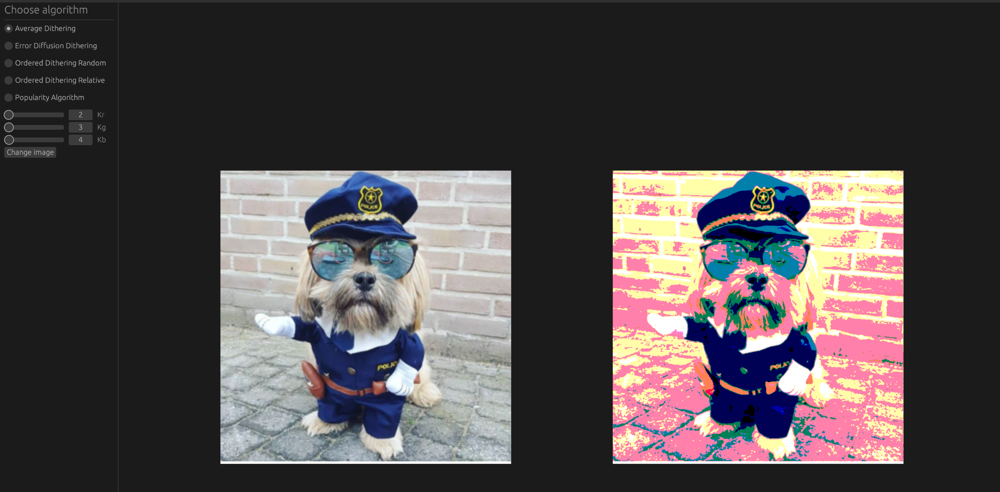
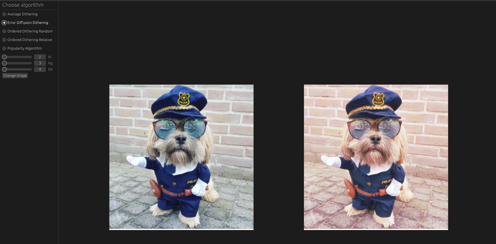
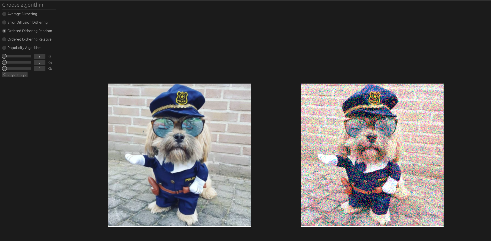
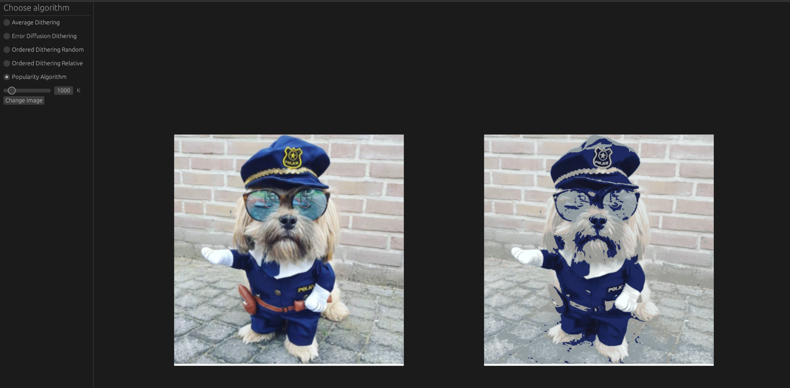

# Color Quantizer

Color Quantizer is a GUI application built with `rust` and `egui` for the 'Computer Graphics 1' course. It provides several algorithms for reducing number of colors used in image. It uses `rayon` for parallelizing calculations. 
 
## Currently implemented algorithms
 - Average Dithering
 - Error Diffusion Dithering
 - Ordered Dithering (Random)
 - Ordered Dithering (Relative)
 - Popularity Algorithm

## Dithering Algorithms

Dithering algorithms accept three parameters: `k_r`, `k_g`, and `k_b` (RGB model is used), which represent the numbers of possible levels in the red, green, and blue channels, respectively.
For example, when `k_r = 2`, `k_g = 3` and `k_b = 4` it means that each pixel in the image can be only built using: 
- `[0, 255]` for red channel
- `[0, 128, 255]` for green channel
- `[0, 85, 170, 255]` for blue channel
Each dithering algorithm uses different techniques for approximating pixels to only use available values.

## Popularity Algorithm

The popularity algorithm accepts one parameter: `k`, which is the maximum number of colors that should be used. Then, for each pixel, it finds the closest color among the `k` most-used colors based on the Euclidean distance in the R^3 RGB space.

## Running

*Prerequisites*:
 - rust >= `1.81`

Enter project's root directory and run:
```shell
cargo r --release
```

## Examples





